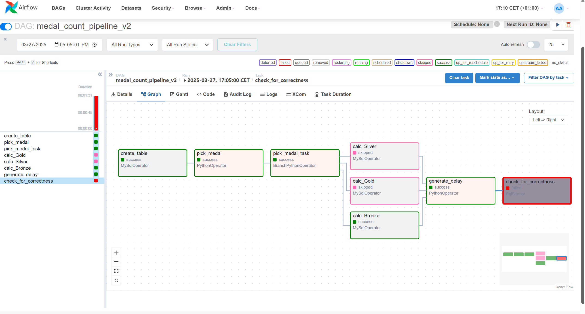
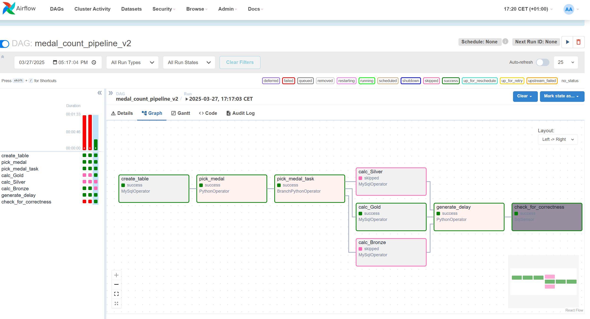

# goit-de-hw-07

# 1. Delay = 35 sec
 
## Сенсор упав по тайм-ауту, бо ми навмисно в generate_delay поставив sleep(35) — а сенсор мав встигнути перевірити запис протягом 30 секунд.
Отже:
  * Сенсор відпрацював як треба
  * DAG перевірив затримку коректно
  * Вся логіка спрацювала

# 2. Delay = 10 sec

## Сенсор пройшов успішно.
Отже:
  * Запис у таблиці viacheslav.medal_results був не старший за 30 секунд
  * time.sleep(10) відпрацював
  * SqlSensor встиг перевірити свіже значення і повернув True
